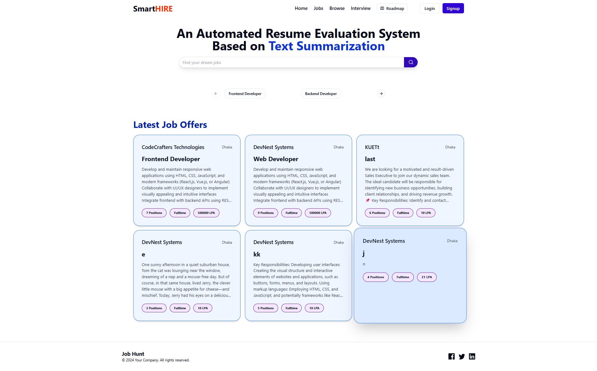

# AI-Powered Job Portal

A comprehensive AI-powered job portal for recruiters and students.

---

## Features

### Recruiter
- Post companies and job openings
- View summarized resumes
- Accept/reject applicants

### Student / Job Seeker
- Build & customize resumes
- Build smart portfolio *(Partner’s Work)*
- Browse & apply for jobs with summarized descriptions
- AI Chatbot for guidance
- AI Voice Assistant for interview practice
- Take quizzes to test skills
- Career Roadmap *(Partner’s Work)*
- Mock Interviews *(Partner’s Work)*
- Backend API: Node.js, Express, MongoDB *(Partner’s Work)*
- Frontend UI: React, Redux, Vite, Material-UI
- Resume Screening & Analysis: ML models, TF-IDF, Random Forest
- Text Summarization: FastAPI + Transformers
- Chatbot Integration: Vanilla JS + Vite

---

## Demo / Screenshots
  
[Watch the demo video](https://your-video-link.com)

---

## Tech Stack
- Frontend: React, Redux, Vite, Material-UI, Tailwind CSS  
- Backend: Node.js, Express, MongoDB, Mongoose  
- AI/ML: FastAPI, Flask, Transformers, Google Generative AI  
- Others: Clerk authentication, Cloudinary, TF-IDF, Random Forest  

---

## Contributors
- **Partner:** AI Mock Interview, Smart Portfolio Builder, Career Roadmap  
- **Me:** All other features including Resume Builder, AI Voice Assistant, Backend API, Chatbot, Quiz Module, Resume Screening & Summarizer, Frontend UI  

---

## Getting Started

1. Clone the repository:
   ```bash
   git clone https://github.com/yourusername/your-repo.git
2. Install dependencies for each module (frontend, backend, AI services) according to their README instructions.
3. Run the backend server and frontend application.
4. Explore the platform as a recruiter or student to experience all features.

---

## License

This project is licensed under the **MIT License**.  

See the [LICENSE](./LICENSE) file for more details.

